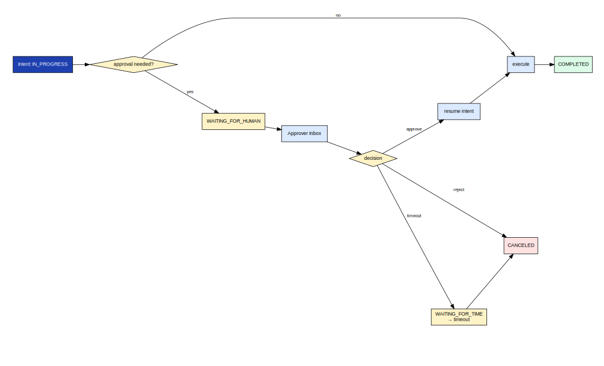
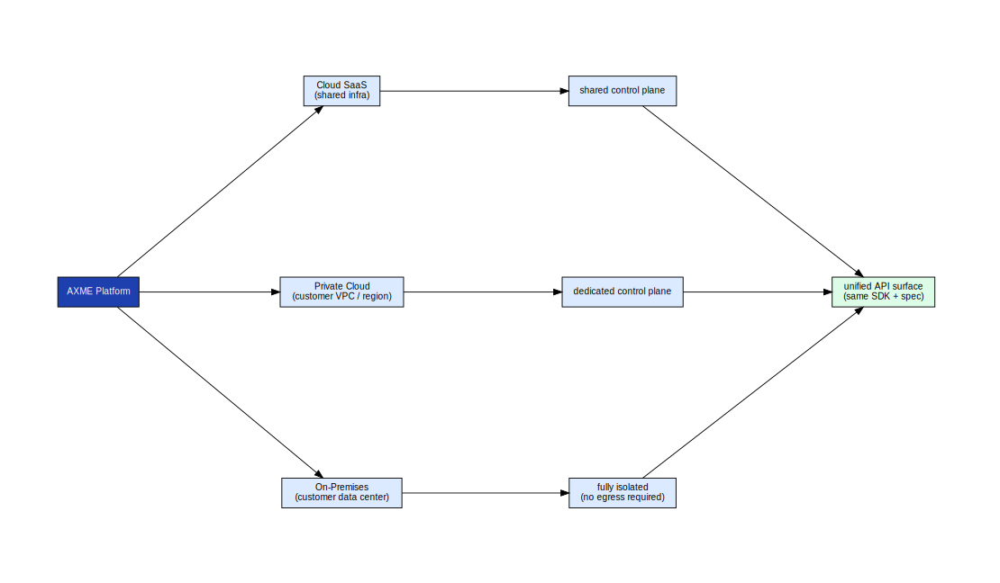
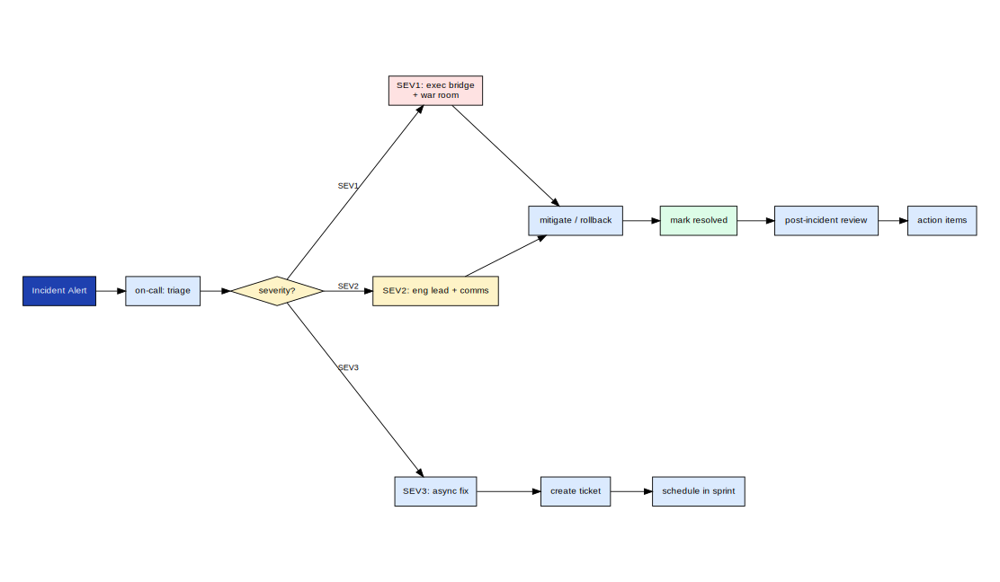

# axme-reference-clients

**Reference client implementations for AXME Cloud surfaces.** This repository contains full-featured reference applications — not toy examples, but real working clients that demonstrate enterprise portal workflows, approval flows, and admin operations against the AXME platform.

> **Alpha** · Reference clients are being built alongside the platform. Bootstrap phase in progress.  
> Access and feedback → [hello@axme.ai](mailto:hello@axme.ai)

---

## What This Repository Is For

`axme-reference-clients` bridges the gap between "I understand the API" and "I understand how to build a real application on AXME." Each reference client is:

- **A complete working application** — not a snippet, a real app with auth, error handling, and UI
- **A blueprint** — shows the idiomatic patterns for each platform surface
- **A test harness** — includes smoke and e2e checks that validate against the staging gateway

---

## Included Reference Clients

### Enterprise Portal (Track F Governance Surface)

The enterprise portal reference client demonstrates the full Track F governance and admin workflow: managing organizations, workspaces, users, service accounts, and access grants.

```
enterprise-portal/
├── src/                       # Portal application source
└── README.md                  # Portal-specific setup and usage
```

**Planned flows this client covers:**

- Organization and workspace management
- User registration and role assignment  
- Service account creation and key management
- Access grant configuration
- Quota monitoring and enforcement

The human-in-the-loop approval flow — the core of the enterprise portal experience:



*Approvals arrive in the portal inbox. The approver sees intent context, policy constraints, and expiry. Approval or rejection triggers an immediate state transition and notifies the sender via webhook.*

### Enterprise Placement and Boundaries

How the enterprise portal client maps to the AXME platform's multi-tenant architecture:



*Each organization is an isolated tenant. Workspaces scope resources within an org. The portal client operates at the org-admin level, able to manage workspaces, users, and service accounts within the org boundary.*

---

## Planned Client Matrix

| Client | Surface | Status |
|---|---|---|
| `enterprise-portal` | Track F governance and admin UI | 🔜 Bootstrap |
| `intent-dashboard` | Real-time intent lifecycle viewer | 🔜 Planned |
| `approval-inbox` | Human-in-the-loop approval UI | 🔜 Planned |
| `webhook-receiver` | Reference webhook receiver with signature verification | 🔜 Planned |

---

## Incident Response Reference

The incident response swimlane is directly relevant to portal admin users who need to act on security events:



*The portal surfaces the controls an org admin needs during an incident: revoke API keys, suspend service accounts, review audit logs, and trigger an access lockdown.*

---

## Repository Status

Bootstrap phase. The enterprise-portal skeleton is scaffolded. Full implementation is in progress.

See [`CONTENT_ROADMAP_ALPHA.md`](CONTENT_ROADMAP_ALPHA.md) for the detailed plan.

---

## Related Repositories

| Repository | Role |
|---|---|
| [axme-docs](https://github.com/AxmeAI/axme-docs) | Full API reference — clients implement these APIs |
| [axme-sdk-typescript](https://github.com/AxmeAI/axme-sdk-typescript) | TypeScript SDK used by web portal client |
| [axme-examples](https://github.com/AxmeAI/axme-examples) | Simpler, use-case-focused code examples |
| [axme-conformance](https://github.com/AxmeAI/axme-conformance) | Conformance suite — smoke tests mirror these clients |

---

## Contributing & Contact

- Reference client proposals: open an issue in this repository
- Alpha program access and feedback: [hello@axme.ai](mailto:hello@axme.ai)
- Security disclosures: see [SECURITY.md](SECURITY.md)
- Contribution guidelines: [CONTRIBUTING.md](CONTRIBUTING.md)
